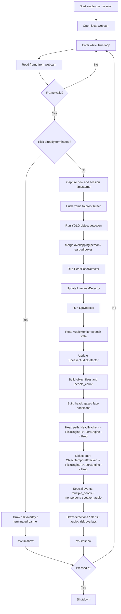

# Single-User to Multi-User Architecture Migration Report

## Scope and intent

This report explains the architectural move from the original single-user proof of concept in:

- `single user`: `/home/krushang/Desktop/ai-proctor-vision-poc`
- `multi user`: `/home/krushang/Desktop/exam-proctoring-ai/engine`

It is intentionally focused on the **core structural architecture** of the engine. It does **not** treat EC2 deployment as the reason multi-user became possible. Hosting can change scale characteristics, but it is not what created multi-user capability. The real change was a redesign of how sessions, state, transport, inference, and timing were organized.

The scoring model was **not fundamentally redesigned** as part of this migration. The same core risk/alert model still exists; the big change was how that logic is packaged and driven for many concurrent candidates. There is one additive scoring path for tab switching in the newer engine, but the multi-user transition itself is primarily an orchestration and state-isolation refactor.

---

## Executive summary

The original POC was single-user because it was built as **one local webcam loop with one set of live state**. One process, one `cv2.VideoCapture(0)`, one `while True`, one frame at a time, one candidate. Every detector and every stateful component lived inside that one loop and assumed it owned the full frame stream.

The multi-user engine became possible because the architecture was split into three clear layers:

1. **Transport / ingestion layer**
   Each candidate connects through WebRTC and gets an independent video/audio stream.

2. **Per-candidate session layer**
   Each candidate gets a `ProctorSession` object containing their own detection state, trackers, risk state, logs, proof output, and event subscribers.

3. **Shared orchestration layer**
   A central `ProctorCoordinator` owns the single shared YOLO model and runs a batched tick loop across all active sessions.

That redesign solved the real blockers:

- the old system had no notion of a session registry
- the old system had no way to ingest many candidate streams at once
- the old system coupled UI rendering, webcam capture, inference, and report writing into one loop
- the old system used frame-rate-sensitive logic that would distort badly if one loop were naively shared among many users

The new system fixes those issues by:

- creating one `ProctorSession` per candidate
- storing the latest frame/audio per candidate independently
- batching YOLO across many candidates in one forward pass
- scheduling MediaPipe separately from transport
- converting critical temporal logic from frame-count semantics to time-based or tick-rate-aware semantics
- exposing per-session outputs through APIs/SSE instead of a local OpenCV window

---

## 1. What the single-user architecture actually was

### 1.1 Topology

In the original POC, `main.py` is the application. It opens one local webcam and runs the entire proctoring pipeline inside one sequential loop:

- webcam capture
- YOLO object detection
- MediaPipe head/gaze/blink
- lip activity
- liveness
- risk scoring
- alert routing
- proof capture
- local OpenCV rendering

Code anchor:

- `cv2.VideoCapture(0)` in `/home/krushang/Desktop/ai-proctor-vision-poc/main.py:176`
- component construction in `/home/krushang/Desktop/ai-proctor-vision-poc/main.py:234`
- single sequential loop in `/home/krushang/Desktop/ai-proctor-vision-poc/main.py:313`

### 1.2 Simplified flow

```text
Local webcam
  -> main.py while True
     -> YOLO on current frame
     -> MediaPipe on same frame
     -> lip/audio checks
     -> object/head/liveness trackers
     -> risk engine
     -> alert engine
     -> proof writer
     -> cv2.imshow()
```

### 1.3 Why this is inherently single-user

The old architecture was not just "currently used by one user." It was **designed around one continuously-owned frame source**:

- one camera handle: `/home/krushang/Desktop/ai-proctor-vision-poc/main.py:176`
- one session clock: `/home/krushang/Desktop/ai-proctor-vision-poc/main.py:180-181`
- one alert log and one warning log: `/home/krushang/Desktop/ai-proctor-vision-poc/main.py:183-184`
- one `states` dict for all duration gates: `/home/krushang/Desktop/ai-proctor-vision-poc/main.py:186-202`
- one `session_dir` / `proof_dir`: `/home/krushang/Desktop/ai-proctor-vision-poc/main.py:228-232`
- one set of detector/tracker instances: `/home/krushang/Desktop/ai-proctor-vision-poc/main.py:234-271`
- one UI surface: `cv2.imshow(...)` in `/home/krushang/Desktop/ai-proctor-vision-poc/main.py:324` and `/home/krushang/Desktop/ai-proctor-vision-poc/main.py:463`

There is no session abstraction. The whole process itself is the session.

### 1.4 Single-user loop structure

Below is the exact logical shape of the original single-user loop when the algorithm was running on each frame.

#### Text flow

For every iteration of the loop in the original POC:

1. Read one frame from the local webcam.
2. Reject obviously bad frames using a simple dark/low-variance quality guard.
3. If the exam is already terminated:
   show the termination/risk overlay, display the frame, and wait for quit.
4. Record current wall-clock time and session-relative monotonic time.
5. Push the current frame into the proof buffer if proof capture is enabled.
6. Run YOLO object detection on the frame.
7. Merge overlapping detections for some classes such as `person` and `earbud`.
8. Run head/gaze/face analysis using `HeadPoseDetector`.
9. Update the liveness detector from yaw, pitch, gaze, and blink output.
10. Run lip analysis and combine it with audio activity to detect speaker-audio mismatch.
11. Convert detections into object flags such as:
    `phone`, `book`, `headphone`, `earbud`, and `people_count`.
12. Build head-related conditions such as:
    `looking_away`, `looking_down`, `looking_up`, `looking_side`, `face_hidden`, `partial_face`, `fake_presence`.
13. For each head-related condition:
    pass it through `HeadTracker` for duration gating, then into `RiskEngine`, then into `AlertEngine`, and optionally save proof.
14. For each object-related condition:
    pass it through `ObjectTemporalTracker` for stability, then into `RiskEngine`, then into `AlertEngine`, and optionally save proof.
15. Independently process special conditions:
    `multiple_people`, `no_person`, and `speaker_audio`.
16. Draw debug overlays, active alerts, audio indicator, risk overlay, and partial-face banner if enabled.
17. Show the final frame in the OpenCV window.
18. Wait for `q` to quit.

Code anchors:

- loop start: `/home/krushang/Desktop/ai-proctor-vision-poc/main.py:313`
- object detection: `/home/krushang/Desktop/ai-proctor-vision-poc/main.py:336-339`
- head detection: `/home/krushang/Desktop/ai-proctor-vision-poc/main.py:341-354`
- liveness and lip/audio: `/home/krushang/Desktop/ai-proctor-vision-poc/main.py:356-372`
- head-condition scoring path: `/home/krushang/Desktop/ai-proctor-vision-poc/main.py:387-414`
- object scoring path: `/home/krushang/Desktop/ai-proctor-vision-poc/main.py:416-452`
- rendering: `/home/krushang/Desktop/ai-proctor-vision-poc/main.py:454-463`

#### Mermaid flow



#### Short interpretation

The important point is that **everything happened inline inside one frame loop**. Frame acquisition, inference, temporal gating, scoring, alerting, proof writing, and UI rendering all belonged to the same sequential control path. That is exactly why the old architecture was simple for one user, but structurally unsuitable for many concurrent users.

---

## 2. Why multiple users were not possible earlier

This is the core question. The answer is not "because it was not on EC2." The answer is that the old design had several structural single-user assumptions.

### 2.1 One physical input source, not many logical streams

The first hard limit is simple: the old engine reads from a single local webcam with:

```python
cap = cv2.VideoCapture(0)
```

Code anchor:

- `/home/krushang/Desktop/ai-proctor-vision-poc/main.py:176`

That means the pipeline had exactly one producer of frames. There was no abstraction for:

- session IDs
- per-user transport
- remote candidate streams
- stream registration / deregistration

Without a stream-ingestion layer, there was nowhere for "user 2" to even enter the system.

### 2.2 Monolithic control flow: capture, inference, scoring, and UI were fused

In the old design, the same function:

- reads the frame
- runs all detectors
- updates state machines
- captures proof
- renders overlays
- blocks on `cv2.waitKey`

Code anchors:

- loop body start: `/home/krushang/Desktop/ai-proctor-vision-poc/main.py:313`
- detection section: `/home/krushang/Desktop/ai-proctor-vision-poc/main.py:336-372`
- risk / alert updates: `/home/krushang/Desktop/ai-proctor-vision-poc/main.py:387-452`
- rendering: `/home/krushang/Desktop/ai-proctor-vision-poc/main.py:454-463`

This makes the pipeline **session-local and UI-bound**. It is not a reusable inference service. A multi-user server needs transport and presentation to be decoupled from scoring.

### 2.3 All mutable state lived in one application scope

The single-user version instantiates stateful components directly inside `main()`:

- `ObjectTemporalTracker`
- `HeadTracker`
- `LivenessDetector`
- `AudioMonitor`
- `SpeakerAudioDetector`
- `RiskEngine`
- `ProofWriter`

Code anchor:

- `/home/krushang/Desktop/ai-proctor-vision-poc/main.py:234-271`

That means:

- all timing state belongs to one candidate
- all occurrence counters belong to one candidate
- all proof buffers belong to one candidate
- all logs belong to one candidate

Those objects were not isolated behind a reusable per-session boundary. They were just local variables in one main loop.

### 2.4 There was no session registry or lifecycle manager

The old architecture had no equivalents of:

- `add_session`
- `remove_session`
- `sessions[pc_id]`
- per-session cleanup on disconnect
- per-session event delivery

So even if multiple streams existed, there was no architecture for:

- creating candidate state at join time
- routing frames to the right state container
- cleaning up only the disconnected candidate
- exposing candidate-specific logs, risk, and proof

### 2.5 Naive round-robin would have broken temporal semantics

Even if we imagined hacking many users into the old loop like this:

```text
for each user:
  grab latest frame
  run full pipeline
```

that would reduce the effective per-user processing cadence. Several old components were frame-count based and would no longer mean the same thing.

#### 2.5.1 Old object stability logic assumed frame-count windows

Old `ObjectTemporalTracker`:

- stores a `deque(maxlen=self.window)`
- appends one observation per processed frame
- declares stable when vote count exceeds a fixed threshold

Code anchor:

- `/home/krushang/Desktop/ai-proctor-vision-poc/core/object_tracker.py:3-20`

This means `window=15` did **not** mean "last 1.5 seconds." It meant "last 15 processed frames."

If one user receives 15 updates quickly, the tracker behaves one way.
If five users share one loop, each user's 15 updates take much longer in wall-clock time.

So the same thresholds would silently change meaning:

- object evidence would linger longer
- false positives would decay slower
- short object appearances could affect the system for too long
- detection stability would become dependent on concurrent user count

That is an architectural problem, not just a performance problem.

#### 2.5.2 Old blink detection assumed enough frame density

Old head-pose logic counted blinks using `BLINK_FRAMES`:

- config uses `BLINK_FRAMES = 2`
- detector increments `blink_counter` while EAR is below threshold
- a blink fires when the counter reaches that frame count

Code anchors:

- config: `/home/krushang/Desktop/ai-proctor-vision-poc/config.py:65-67`
- detector constructor: `/home/krushang/Desktop/ai-proctor-vision-poc/detectors/head_pose_detector.py:51-55`
- detection logic: `/home/krushang/Desktop/ai-proctor-vision-poc/detectors/head_pose_detector.py:171-180`

This is reasonable when one user gets a dense, consistent frame stream. It becomes unreliable when per-user processing becomes sparse or staggered, because "2 frames" stops representing a stable real-world duration.

#### 2.5.3 Some modules were already time-based, but the whole system was not

Not everything was broken by lower cadence. For example:

- `HeadTracker` duration logic was based on elapsed time
- risk timers were wall-clock based
- audio had its own monitoring thread

But the system as a whole was still not multi-user safe, because the control plane around those modules remained single-user and some crucial gates still depended on frame cadence.

### 2.6 Rendering assumptions were local-desktop assumptions

The old system used:

- `cv2.imshow`
- `cv2.waitKey`
- inline overlay drawing into the same frame used for inference

Code anchors:

- `/home/krushang/Desktop/ai-proctor-vision-poc/main.py:322-326`
- `/home/krushang/Desktop/ai-proctor-vision-poc/main.py:454-463`

A multi-user backend cannot depend on a single machine-local OpenCV window. It needs network-readable outputs per session.

### 2.7 Reports/proof were bound to a single exam run

The old system creates one `session_dir` and one `proof_dir` in the process:

- `/home/krushang/Desktop/ai-proctor-vision-poc/main.py:228-232`

That is fine for one run, but multi-user requires:

- one report directory per candidate session
- parallel proof generation without cross-user mixing
- clean separation of evidence artifacts by candidate

Again, not an EC2 issue. A file-layout and session-ownership issue.

---

## 3. What changed in the multi-user architecture

The multi-user system is not the old loop wrapped in an API. It is a proper split into transport, session state, and orchestration.

### 3.1 New top-level architecture

```text
Candidate browser (WebRTC video/audio)
  -> FastAPI/aiortc transport layer
     -> per-candidate ProctorSession
        -> shared ProctorCoordinator tick loop
           -> batched YOLO across sessions
           -> per-session MediaPipe / lip / liveness
           -> per-session risk + alert + proof
     -> APIs / SSE / snapshots / reports
```

### 3.2 Transport was separated from inference

The new `server.py` accepts WebRTC offers and creates a distinct connection and session per candidate:

- `RTCPeerConnection`
- generated `pc_id`
- `stream_stats[pc_id]`
- `ProctorSession(...)`
- `coordinator.add_session(pc_id, session)`

Code anchor:

- `/home/krushang/Desktop/exam-proctoring-ai/engine/server.py:985-1029`

This is the moment the system stops being "one process = one candidate" and becomes "one process = many candidate sessions."

### 3.3 Video/audio ingestion became per-session producers

`VideoAnalyzerTrack` receives video from a candidate and writes the latest frame into that candidate's session:

- decode frame
- optionally resize to 480p
- keep an admin snapshot
- write `session.latest_frame`
- update `session.observed_fps`

Code anchor:

- `/home/krushang/Desktop/exam-proctoring-ai/engine/server.py:166-244`

`AudioAnalyzerTrack` does the same for audio and pushes PCM into that candidate's session ring buffer:

- `/home/krushang/Desktop/exam-proctoring-ai/engine/server.py:247-280`

This is a major structural change:

- transport receives data continuously
- inference no longer happens inline with frame reception
- each session has its own latest input state

That decoupling is what lets many streams coexist.

### 3.4 A dedicated per-candidate state container was introduced

The new `ProctorSession` is the most important architecture change.

It encapsulates, per candidate:

- session ID / session directory
- latest frame / observed fps
- alert and warning logs
- SSE subscribers
- detection state dict
- FaceMesh / head detector / lip detector
- object tracker / head tracker / liveness / risk engine
- audio monitor / speaker-audio detector
- proof writer

Code anchors:

- class purpose: `/home/krushang/Desktop/exam-proctoring-ai/engine/core/proctor_session.py:1-8`
- constructor and session identity: `/home/krushang/Desktop/exam-proctoring-ai/engine/core/proctor_session.py:71-100`
- per-candidate state dict and logs: `/home/krushang/Desktop/exam-proctoring-ai/engine/core/proctor_session.py:102-127`
- per-candidate detectors/state machines: `/home/krushang/Desktop/exam-proctoring-ai/engine/core/proctor_session.py:133-189`

This is the answer to "how did we stop shared-state collisions?" We stopped treating the process as the session and started treating `ProctorSession` as the session.

### 3.5 A central multi-user orchestrator was introduced

The new `ProctorCoordinator` owns the shared, expensive inference resources and the global scheduling policy.

Its responsibilities:

- hold the single shared YOLO model
- hold the `sessions` registry
- drive a fixed-rate tick loop
- snapshot active sessions
- batch frames for one YOLO forward pass
- schedule MediaPipe work
- call `session.update(...)` for each candidate

Code anchors:

- coordinator overview: `/home/krushang/Desktop/exam-proctoring-ai/engine/core/proctor_coordinator.py:1-15`
- shared detector and session registry: `/home/krushang/Desktop/exam-proctoring-ai/engine/core/proctor_coordinator.py:59-100`
- session lifecycle: `/home/krushang/Desktop/exam-proctoring-ai/engine/core/proctor_coordinator.py:146-170`
- tick loop: `/home/krushang/Desktop/exam-proctoring-ai/engine/core/proctor_coordinator.py:174-199`
- tick execution: `/home/krushang/Desktop/exam-proctoring-ai/engine/core/proctor_coordinator.py:201-260`

This is the other half of the multi-user answer: expensive inference is centralized, candidate state is decentralized.

### 3.6 YOLO became a shared batched resource instead of per-session local work

The new `ObjectDetector` explicitly supports `detect_batch(frames)`, performing one forward pass across many candidate frames:

- detector design note: batch inference is a first-class feature
- `detect_batch` returns a result list aligned to the input frame list

Code anchors:

- detector design comment: `/home/krushang/Desktop/exam-proctoring-ai/engine/detectors/object_detector.py:99-107`
- batch method: `/home/krushang/Desktop/exam-proctoring-ai/engine/detectors/object_detector.py:241-270`

This is critical because it avoids the worst old scaling path:

- old world: YOLO called inside each user's loop
- new world: one coordinator tick batches all candidate frames together

So the expensive detector is shared structurally, not duplicated per session.

### 3.7 MediaPipe was decoupled from the transport path and made schedulable

`ProctorCoordinator._tick()` decides which sessions need MediaPipe work that tick:

- only active non-terminated sessions are considered
- only some sessions may run MediaPipe each tick when stride is enabled
- skipped sessions reuse last known MediaPipe output

Code anchors:

- session snapshot: `/home/krushang/Desktop/exam-proctoring-ai/engine/core/proctor_coordinator.py:201-215`
- MediaPipe scheduling and reuse: `/home/krushang/Desktop/exam-proctoring-ai/engine/core/proctor_coordinator.py:217-251`

And `ProctorSession.run_mediapipe()` provides a session-local MediaPipe execution unit:

- `/home/krushang/Desktop/exam-proctoring-ai/engine/core/proctor_session.py:398-419`

This matters because multi-user systems need **scheduling policy**. The old design had none; it simply processed whatever the one loop was currently on.

### 3.8 Session updates became pure per-candidate state transitions

Once batched YOLO and scheduled MediaPipe finish, the coordinator calls:

```python
session.update(detections, mp_result, frame, now, fps)
```

Code anchors:

- coordinator call site: `/home/krushang/Desktop/exam-proctoring-ai/engine/core/proctor_coordinator.py:261-269`
- session update body: `/home/krushang/Desktop/exam-proctoring-ai/engine/core/proctor_session.py:423-566`

This is architecturally clean:

- transport writes inputs into session slots
- coordinator decides when to compute
- session update applies candidate-local rules and state machines

That separation did not exist before.

---

## 4. Timing and temporal logic changes required for multi-user correctness

This is one of the most important technical details. Multi-user is not only about feeding many streams. It is also about preserving the meaning of temporal rules under reduced or staggered per-user cadence.

### 4.1 Object tracking was changed from frame-count-based to time-based

#### Old version

The old tracker used a deque of fixed frame count:

- `/home/krushang/Desktop/ai-proctor-vision-poc/core/object_tracker.py:3-20`

Meaning:

- semantics depended on how often the user got processed
- concurrent load could change behavior without changing thresholds

#### New version

The new tracker uses:

- wall-clock timestamps per observation
- a time window `window_s`
- dynamic `min_votes` scaled by observed fps
- a floor to avoid requiring too few samples

Code anchor:

- `/home/krushang/Desktop/exam-proctoring-ai/engine/core/object_tracker.py:25-119`

This was one of the most important correctness changes for multi-user. It means:

- "stable detection" keeps approximately the same real-world meaning
- object logic no longer silently changes just because more candidates are active

### 4.2 Blink detection was changed from frame-count to duration-based

#### Old version

- config: `BLINK_FRAMES = 2`
- detection: increment a counter for closed-eye frames

Code anchors:

- `/home/krushang/Desktop/ai-proctor-vision-poc/config.py:65-67`
- `/home/krushang/Desktop/ai-proctor-vision-poc/detectors/head_pose_detector.py:171-180`

#### New version

The newer engine uses:

- `BLINK_MIN_DURATION_S`
- `BLINK_MAX_DURATION_S`
- monotonic-time blink start tracking

Code anchors:

- config rationale: `/home/krushang/Desktop/exam-proctoring-ai/engine/config.py:61-69`
- detector config: `/home/krushang/Desktop/exam-proctoring-ai/engine/detectors/head_pose_detector.py:71-78`
- detection logic: `/home/krushang/Desktop/exam-proctoring-ai/engine/detectors/head_pose_detector.py:297-321`

This change directly acknowledges multi-user cadence changes. A blink should mean a real-world short eye closure, not "N processed frames."

### 4.3 The coordinator introduced a controlled engine tick rate

The old pipeline was basically camera-driven. The new one is coordinator-driven:

- target `TICK_RATE = 10`
- every tick, snapshot active sessions and process them

Code anchor:

- `/home/krushang/Desktop/exam-proctoring-ai/engine/core/proctor_coordinator.py:37-42`
- `/home/krushang/Desktop/exam-proctoring-ai/engine/core/proctor_coordinator.py:174-199`

This gives the engine a stable processing rhythm independent of raw inbound frame cadence.

### 4.4 Session update tracks effective tick FPS explicitly

`ProctorSession.update()` estimates actual tick frequency and uses it for object tracker vote scaling:

- `/home/krushang/Desktop/exam-proctoring-ai/engine/core/proctor_session.py:440-448`
- object tracker call uses `_tick_fps`: `/home/krushang/Desktop/exam-proctoring-ai/engine/core/proctor_session.py:553`

This is subtle but important. In the multi-user engine, the per-candidate effective cadence is not simply the camera FPS. It is the coordinator tick cadence after scheduling. The new design measures and uses the correct one.

---

## 5. What did not fundamentally change

The move to multi-user was **not** a rewrite of the core proctoring rules.

### 5.1 The same core pipeline stages still exist

The newer engine still performs the same logical steps per candidate:

- object detection
- head/gaze detection
- lip/audio correlation
- liveness checks
- temporal gating
- risk scoring
- alert generation
- proof/report generation

Those stages were moved into `ProctorSession.update(...)`, but they remain the same conceptual pipeline.

Code anchor:

- `/home/krushang/Desktop/exam-proctoring-ai/engine/core/proctor_session.py:459-566`

### 5.2 Risk and alerting remain core per-candidate state machines

`RiskEngine`, `AlertEngine`, `HeadTracker`, `LivenessDetector`, `SpeakerAudioDetector` still exist and still operate per candidate. The migration did not replace the risk model with a different architecture; it wrapped those engines in proper session isolation.

### 5.3 Scoring was not redesigned to enable multi-user

The main multi-user unlock was not score math. It was:

- sessionization
- transport separation
- orchestration
- timing fixes

There is an added tab-switch event path in the newer codebase, but that is an additive feature, not the reason multi-user became possible.

---

## 6. New capabilities created by the architecture change

Once the architecture was sessionized and centralized, several capabilities became natural.

### 6.1 Per-session APIs and observability

The server now exposes candidate-specific endpoints:

- `/sessions`
- `/snapshot/{pc_id}`
- `/risk/{pc_id}`
- `/session/{pc_id}/log`
- `/alerts/{pc_id}`
- `/stream/{pc_id}`

Code anchors:

- `/home/krushang/Desktop/exam-proctoring-ai/engine/server.py:292-383`
- SSE stream: `/home/krushang/Desktop/exam-proctoring-ai/engine/server.py:515-549`

These are possible because session identity now exists as a first-class concept.

### 6.2 Clean session lifecycle

When a connection is created:

- build `ProctorSession`
- register it with the coordinator

When it disconnects:

- remove it from the coordinator
- stop audio
- flush proof writer
- save report
- notify SSE subscribers

Code anchors:

- creation: `/home/krushang/Desktop/exam-proctoring-ai/engine/server.py:1018-1029`
- disconnect cleanup: `/home/krushang/Desktop/exam-proctoring-ai/engine/server.py:1120-1135`
- session shutdown: `/home/krushang/Desktop/exam-proctoring-ai/engine/core/proctor_session.py:568-596`

The old design only had whole-process shutdown.

### 6.3 Runtime exam-level controls

The coordinator now maintains shared exam config and runtime settings:

- `exam_config` for live detection toggles across active sessions
- `runtime_settings` for config values applied at session creation

Code anchors:

- config ownership: `/home/krushang/Desktop/exam-proctoring-ai/engine/core/proctor_coordinator.py:94-100`
- live override logic: `/home/krushang/Desktop/exam-proctoring-ai/engine/core/proctor_coordinator.py:161-170`
- session reads shared config: `/home/krushang/Desktop/exam-proctoring-ai/engine/core/proctor_session.py:218-225`

Again, this depends on the existence of session boundaries and a central coordinator.

---

## 7. Before vs after

### 7.1 Before

```text
One machine webcam
  -> one Python loop
     -> one candidate state
     -> one report
     -> one UI window
```

### 7.2 After

```text
Many candidate browsers
  -> many WebRTC connections
     -> many ProctorSession objects
        -> one ProctorCoordinator
           -> one shared YOLO batch pass
           -> scheduled per-session MediaPipe
           -> independent per-session scoring/output
```

### 7.3 Most important conceptual shift

The old design answered:

- "How do we proctor one live frame stream?"

The new design answers:

- "How do we maintain many isolated candidate states while sharing only the expensive compute?"

That is the real migration.

---

## 8. Direct answer to the question "why were multiple users not possible earlier?"

Multiple users were not possible earlier because the original system lacked all of the following:

1. **A multi-stream ingress layer**
   The old engine only knew how to read one local webcam.

2. **A session abstraction**
   All mutable state lived inside one `main()` function.

3. **A session registry**
   There was no data structure mapping candidate identities to state containers.

4. **A shared inference orchestrator**
   YOLO ran inline for one frame in one loop rather than as a batched shared service.

5. **Timing-safe temporal logic for variable cadence**
   Some key rules depended on processed frame count and would distort under round-robin multi-user processing.

6. **A network-facing output model**
   The old system rendered to one local OpenCV window instead of exposing per-session state/events.

So the real reason was not infrastructure. The reason was that the original code embodied a **single-session program model**.

---

## 9. Direct answer to the question "what changes made it multi-user?"

These are the changes that actually unlocked multi-user operation:

1. **WebRTC/FastAPI transport replaced local-only webcam capture**
   Candidate media became network streams, not one local device.

2. **`ProctorSession` introduced per-candidate state isolation**
   Every candidate got independent trackers, logs, proof, risk, and transport buffers.

3. **`ProctorCoordinator` introduced centralized orchestration**
   One engine loop can now manage many sessions safely.

4. **YOLO was centralized and batched**
   Expensive object detection became a shared service instead of duplicated inline work.

5. **MediaPipe execution became schedulable**
   It is now run per session under coordinator control, with reuse/stride support.

6. **Temporal logic was adapted for multi-user cadence**
   Object stability became time-based and blink detection became duration-based.

7. **Outputs were externalized**
   SSE, APIs, snapshots, and per-session reports replaced a single local display loop.

That combination, not cloud hosting, is what transformed the system from single-user to multi-user.

---

## Final conclusion

The migration from single-user to multi-user was fundamentally an **architecture refactor from a monolithic local loop into a sessionized distributed inference service**.

The old system was single-user because:

- input was singular
- state was singular
- scheduling was singular
- presentation was singular

The new system is multi-user because:

- input is per candidate
- state is per candidate
- orchestration is centralized
- heavy inference is shared
- temporal logic is corrected for variable cadence
- outputs are exposed per candidate instead of rendered locally

In short:

**We did not make the old single-user loop "faster." We changed the system model from one loop owning one candidate to one coordinator owning many isolated sessions.**
